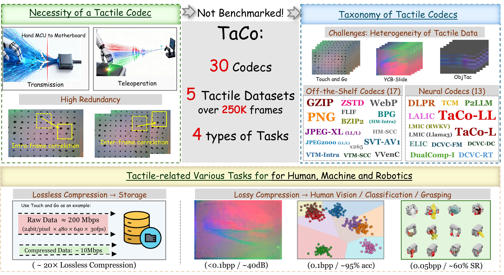

<!-- <p align="center">
  <strong>Official Code for ICLR 2026</strong>
</p> -->

<h1 align="center">
  TaCo: A Benchmark for Lossless and Lossy Codecs of Heterogeneous Tactile Data
</h1>

🎉 **Accepted by ICLR 2026 Main Conference (Dataset and Benchmark Track).**

📄 **Paper:** https://arxiv.org/pdf/2602.09893



Tactile sensing is crucial for embodied intelligence, providing fine-grained perception and control in complex environments. However, efficient tactile data compression, which is essential for real-time robotic applications under strict bandwidth constraints, remains underexplored. The inherent heterogeneity and spatiotemporal complexity of tactile data further complicate this challenge. To bridge this gap, we introduce TaCo-LL, the first comprehensive benchmark for Tactile data Codecs. TaCo evaluates 30 compression methods, including off-the-shelf compression algorithms and neural codecs, across five diverse datasets from various sensor types. We systematically assess both lossless and lossy compression schemes on four key tasks: lossless storage, human visualization, material and object classification, and dexterous robotic grasping. Notably, we pioneer the development of data-driven codecs explicitly trained on tactile data, TaCo-LL (lossless) and TaCo-L (lossy). Results have validated the superior performance of our TaCo-LL and TaCo-L. This benchmark provides a foundational framework for understanding the critical trade-offs between compression efficiency and task performance, paving the way for future advances in tactile perception.

## Overview

This repository contains the official code used for the ICLR 2026 paper **"TaCo: A Benchmark for Lossless and Lossy Codecs of Heterogeneous Tactile Data"**.

TaCo evaluates **30 compression methods**, including off-the-shelf compression algorithms and neural codecs, across **five tactile data sources** from different sensor types. The benchmark systematically studies both lossless and lossy compression schemes under multiple evaluation settings.

The main evaluation tasks include:

- **Lossless storage**: measuring compression ratios and storage efficiency for tactile data.
- **Lossy image and video compression**: evaluating rate-distortion trade-offs for tactile images and videos.
- **Human visualization**: studying whether compressed tactile signals preserve visually meaningful structure.
- **Downstream classification**: testing the effect of compression on material and object recognition tasks.
- **Dexterous robotic grasping**: analyzing how compression influences task-level robotic performance.

In addition to evaluating existing codecs, the paper studies data-driven tactile codecs, including **TaCo-LL** for lossless compression and **TaCo-L** for lossy compression.


## Repository Structure

- `lossless/`: notebooks and scripts for lossless compression experiments.
- `lossy/`: notebooks and scripts for lossy tactile image and video compression experiments.
- `classify/`: downstream classification evaluation code and plotting utilities.
- `check_dcvc/`: DCVC-related checking and visualization notebooks.
- `figs/`: generated figures used for analysis and reporting.


## Usage

The repository is organized around experiment notebooks and analysis scripts. A typical workflow is:

1. Prepare the required tactile data and codec outputs locally.
2. Run the corresponding notebooks under `lossless/`, `lossy/`, or `classify/`.
3. Use the analysis notebooks to compute compression statistics, rate-distortion results, and figures.
4. Compare the generated results with the compression output statistics linked below.

Some external codecs require their own installation steps or binaries. Please follow the official installation instructions of each codec before running the corresponding experiment scripts.

## Compression Statistics

The rate-distortion performance data used to draw the figures in the paper is provided under `bdbr/`.

More detailed compression output statistics are available at [TaCo-Bench](https://pan.sjtu.edu.cn/web/share/02d67f524c575c6bffd0b17719fbf0be), organized in the corresponding `statistics` and `analyse` folders under `lossy/` and `lossless/`. These files include the generated statistics and analysis outputs for the lossless and lossy codec evaluations reported in the paper.

## Citation

If you find this benchmark helpful for your research, we would appreciate it if you could cite our paper:

```bibtex
@inproceedings{cheng2026taco,
  title={TaCo: A Benchmark for Lossless and Lossy Codecs of Heterogeneous Tactile Data},
  author={Cheng, Zhengxue and Zhao, Yan and Wang, Keyu and Zhang, Hengdi and Song, Li},
  booktitle={The Fourteenth International Conference on Learning Representations},
  year={2026}
}
```

We also kindly invite you to check out our previous related work on multi-point tactile data compression:

```bibtex
@inproceedings{zhao2025taccompress,
  title={TacCompress: A Benchmark for Multi-Point Tactile Data Compression in Dexterous Hand},
  author={Zhao, Yan and Li, Yang and Cheng, Zhengxue and Zhang, Hengdi and Song, Li},
  booktitle={Proceedings of the 1st International Workshop on Multi-Sensorial Media and Applications},
  pages={54--62},
  year={2025}
}
```

